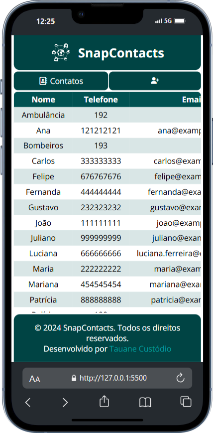

# SnapContacts
SnapContacts é um site de gerencimento de contatos que permite aos usuários adicionar, visualizar, excluir e pesquisar seus contatos.

Esse projeto faz parte dos projetos construídos no curso "Desenvolvedor FullStack Python"

## Índice

- [SnapContacts](#snapcontacts)
  - [Índice](#índice)
  - [Screenshot e deploy](#screenshot-e-deploy)
  - [Tecnologias Utilizadas](#tecnologias-utilizadas)
  - [Funcionalidades](#funcionalidades)
  - [Funcionalidades futuras](#funcionalidades-futuras)
  - [Instalação](#instalação)
  - [Contribuição](#contribuição)
  - [Contato](#contato)

## Screenshot e deploy




## Tecnologias Utilizadas

- HTML
- CSS
- JavaScript
- Regex para validação de entrada

## Funcionalidades

- Adição de contatos com nome, telefone e email
- Validação de campos obrigatórios
- Verificação de contatos duplicados
- Exibição de contatos em uma tabela
- Contagem total de contatos
- Ordenação dos contatos em ordem alfabética
- Responsivo e fácil de usar
- Excluir contatos
- Pesquisar contatos

## Instalação

Instruções sobre como instalar e configurar o projeto localmente.

```bash
# Clone o repositório
git clone https://github.com/tauanecustodio/snap-contacts.git

# Navegue até o diretório do projeto
cd snap-contacts

# Abra o arquivo index.html no seu navegador

```

## Contribuição

Sinta-se à vontade para contribuir com melhorias ou sugestões. Crie uma issue ou envie um pull request!

## Contato

[](https://www.linkedin.com/in/tauanecustodio/)
